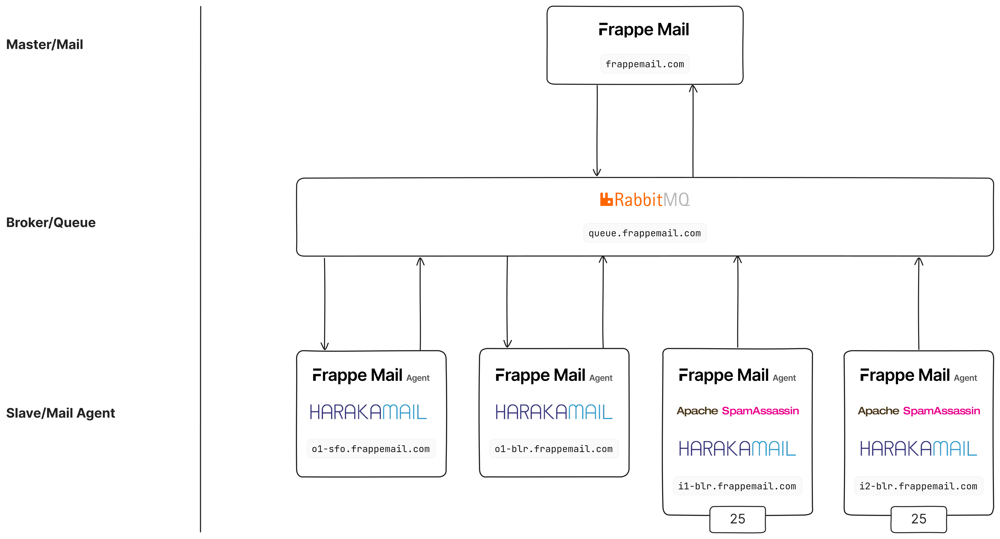

<div align="center">
  
  <h2>Frappe Mail</h2>
</div>

Frappe Mail is an open-source email tool built on the [Frappe Framework](https://github.com/frappe/frappe). It offers a complete infrastructure for sending and receiving emails, managing domains, mailboxes, aliases, and email signing. It provides APIs for users to easily integrate email functionality into their applications. Frappe Mail leverages [RabbitMQ](https://github.com/rabbitmq/rabbitmq-server) for efficient email queuing and [Haraka MTA](https://github.com/haraka/haraka) for SMTP email delivery. [Mail Agent](https://github.com/frappe/mail_agent) consume the queued messages and handle email delivery via Haraka, enabling reliable and scalable email processing.

## Table of Contents

- [Installation](#installation)
- [Mail System Architecture](#mail-system-architecture)
- [Email Sending Process](#email-sending-process)
  - [Email Composition and DKIM Signing](#1-email-composition-and-dkim-signing)
  - [Pushing Emails to RabbitMQ](#2-pushing-emails-to-rabbitmq)
  - [Consuming Emails from RabbitMQ](#3-mail-agent-consuming-emails-from-rabbitmq)
  - [Sending the Email](#4-haraka-sending-the-email)
  - [Custom Plugins in Haraka](#5-custom-plugins-in-haraka-for-delivery-status)
  - [Syncing Delivery Status](#6-syncing-delivery-status)
- [Email Receiving Process](#email-receiving-process)
  - [IP Blacklist Check](#1-ip-blacklist-check)
  - [PTR/RDNS Check](#2-ptrrdns-check)
  - [SPF, DKIM, and DMARC Checks](#3-spf-dkim-and-dmarc-checks)
  - [Queue Handling](#4-queue-handling)
  - [Asynchronous Recipient Handling](#5-asynchronous-recipient-handling)
  - [SpamAssassin Scoring](#6-spamassassin-scoring)
- [Contributing](#contributing)
- [License](#license)

## Installation

You can install this app using the [bench](https://github.com/frappe/bench) CLI:

```bash
cd $PATH_TO_YOUR_BENCH
bench get-app $URL_OF_THIS_REPO --branch develop
bench install-app mail
```

## Mail System Architecture

Frappe Mail is designed with a Master-Slave architecture to efficiently handle high volumes of email traffic while decoupling key email processing tasks. This architecture ensures scalability, reliability, and performance.

<div align="center">
  <br/>
  <picture>
    <source media="(prefers-color-scheme: dark)" srcset=".github/frappe-mail-architecture-dark.png">
    
  </picture>
  <br/>
  <br/>
</div>

### Mail App (Master)

The Mail App serves as the master or producer of outbound emails. When an email is composed and signed, it is not immediately sent. Instead, the email is pushed to a RabbitMQ broker, which manages queuing and asynchronous delivery. This keeps the Mail App responsive and allows it to handle large numbers of emails without being slowed down by the delivery process.

### RabbitMQ (Broker)

RabbitMQ serves as the core message broker in the architecture. It queues emails, ensuring they are processed asynchronously. This decouples the Mail App from the email delivery system, allowing the Mail Agent to consume and deliver the queued emails at its own pace.

### Mail Agent (Slave)

The Mail Agent is responsible for consuming queued messages from RabbitMQ and handling email delivery via Haraka MTA. It plays a critical role in processing both outbound and inbound emails:

- **Haraka MTA:** The Mail Agent forwards the queued messages to Haraka, which handles the actual SMTP-based email delivery. Haraka efficiently sends the emails to their respective recipient mail servers.
- **SpamAssassin Integration:** The Mail Agent includes SpamAssassin, which works alongside Haraka to evaluate incoming emails. SpamAssassin assigns a spam score to each email, which helps in determining the appropriate folder for the message (Inbox, Spam, etc.). SpamAssassin is automatically installed with the Inbound Mail Agent to ensure robust spam detection on inbound emails.

This master-slave architecture makes Frappe Mail modular, scalable, and highly efficient for handling both outbound and inbound email traffic. By relying on RabbitMQ for message queuing, the system decouples email composition from delivery, ensuring robust performance and reliability even under high-volume scenarios.

## Email Sending Process

Frappe Mail is designed to handle email delivery in a modular, scalable way using a combination of RabbitMQ for message queuing, a Mail Agent for email processing, and Haraka for final SMTP delivery. Here's a deeper look at each step of the email-sending process.

### 1. Email Composition and DKIM Signing

When a user sends an email through the Mail App, several actions happen before it is delivered:

- **Email Composition:**

  - The Mail App collects key information such as the sender's address, recipients (To, CC, BCC), subject, body, and any attachments.
  - The email is structured according to the MIME (Multipurpose Internet Mail Extensions) standard, which allows the email to include rich text, attachments, and other media.

- **DKIM Signing:**

  - **DomainKeys Identified Mail (DKIM)** is a method for email authentication that ensures the message has not been altered in transit.
  - A **DKIM signature** is generated by hashing key parts of the email (headers and body) and signing it with the sender’s unique **private key**. This private key is associated with the sender’s domain (e.g., frappe.school).
  - The resulting signature is then embedded in the email headers as a **DKIM-Signature** field. When the email reaches the recipient’s server, this signature can be verified using the sender’s **public key** (published via DNS records) to ensure the email has not been tampered with.
  - The DKIM signing process guarantees the **integrity** of the email during transit and reduces the likelihood of being marked as spam.

  **Example DKIM header:**

  ```plaintext
  DKIM-Signature: v=1; a=rsa-sha256; c=relaxed/simple; d=frappemail.com; i=@frappemail.com; q=dns/txt; s=frappe-school-cb2000ae3f;
                  t=1725623282; h=to : cc : from : date : subject : reply-to : message-id : in-reply-to;
                  bh=36NiEgOw7wBe1ybSgQrTNMwH4CVW397O3gYl4I4Ex9c=;
                  b=D694Lhp/Li25ufrneaVUcddrbYq848mAyY0VvKlCkakDEUxiqOX44HxommAkr2eNWSAtB HbkiXq0/jO3F89rpfDRuLCe3AZ8fwuClDniMwYTslZYIO8tlSpAoC7kCfBADArlQFUwVihw FtUaKuSpfJeUaKhmeYQg1CT63BiGOy+gal57ARWVJdMJatod2REguGqRYXu4cAZemaOd0Uz x7VbwW3x0Egn9QfFIcl3uCHZMCQTE4krfWX9ad0h5XK8WkXcGDF/LjSUnrYCb2WiJxqof2/ Jnpm2HfEKYPTm8gAYmSR1uMw17EbYvtGmoD83hc1ZQWaaKB1mFSyqkVBOIfA==
  ```

### 2. Pushing Emails to RabbitMQ

Once the email is fully composed and signed, the Mail App does not directly send the email to an SMTP server. Instead, it uses RabbitMQ as a queue for asynchronous processing:

- **Why RabbitMQ?**

  - RabbitMQ allows the system to handle large volumes of email asynchronously. This means that emails are not sent immediately, but instead queued, making the system more scalable and preventing performance bottlenecks.
  - By decoupling the email sending from the composition, the Mail App can remain responsive, even when handling high traffic.

- **Message Queuing:**

  - The composed email is formatted into a message payload that includes:
    - **Metadata:** Information like the recipients and a unique **UUID** of the email, which is used later to track and update the delivery status.
    - **Message Body:** The MIME message (with DKIM signature).
  - This message is pushed into a **RabbitMQ queue** where it awaits further processing. The Mail App does not wait for the email to be sent, allowing it to move on to other tasks.

- **RabbitMQ Benefits:**
  - **Scalability:** Multiple emails can be queued without overwhelming the system.
  - **Reliability:** RabbitMQ ensures that no email is lost during transit.
  - **Decoupling:** The Mail App doesn't need to handle email delivery directly, as that responsibility is handed off to the **Mail Agent**.

### 3. Mail Agent: Consuming Emails from RabbitMQ

The **Mail Agent** is a core Python application responsible for consuming emails from the RabbitMQ queue and forwarding them to the **Haraka MTA** for delivery.

- **Mail Agent's Role:**

  - The Mail Agent constantly listens to the RabbitMQ queue. When a new message is available, the Mail Agent picks it up for processing.
  - The Mail Agent is responsible for transforming the email message into a format that can be sent to the SMTP server.

- **Processing Pipeline:**

  - **Queue Consumption:**
    - Once the email has been queued in RabbitMQ, the Mail Agent consumes emails one by one from the queue.
    - The agent extracts the metadata (recipients, UUID) and the MIME message (including the DKIM signature) from the message payload.
  - **SMTP Forwarding:**
    - After consuming an email, the Mail Agent sends it to the Haraka MTA via SMTP.
    - Haraka is configured as the outbound email server and is responsible for delivering the email to the recipient’s mail server using the SMTP protocol.
    - Haraka also performs retries if delivery fails temporarily.
  - **Logging and Monitoring:**
    - The Mail Agent logs each delivery attempt, including the response from Haraka or any errors that may occur.
    - Delivery responses are pushed into RabbitMQ, where the Mail App can retrieve the status and update the corresponding email's state.
    - This ensures robust tracking, allowing any failed emails to be monitored and retried if necessary, while also enabling troubleshooting for debugging purposes.

### 4. Haraka: Sending the Email

The **Haraka MTA** is responsible for sending the email to the recipient’s mail server. Haraka is a highly extensible, high-performance mail transfer agent (MTA) used for both inbound and outbound email.

- **Step-by-Step Process:**

  - **Email Receipt:** The email is received by Haraka from the Mail Agent via an SMTP connection.
  - **SMTP Transaction:** Haraka processes the email through its pipeline of plugins (some custom to Frappe Mail), and attempts to deliver the email to the recipient’s mail server.
  - **DKIM Header:** The DKIM header added by the Mail App is passed along with the email, ensuring that the recipient’s server can verify the authenticity of the email.
  - **SPF and DMARC Compliance:** Haraka also ensures that emails comply with SPF (Sender Policy Framework) and DMARC (Domain-based Message Authentication, Reporting, and Conformance) protocols. This reduces the likelihood that emails are marked as spam by recipient servers.

- **Custom Haraka Plugins:**

  - **Tracking and Response Handling:** Haraka is extended with custom plugins that capture responses from recipient mail servers. These responses can indicate whether the email was delivered successfully, bounced, or rejected.
  - **Push to RabbitMQ:** Once Haraka receives a response from the recipient server, the plugin pushes this information back to the RabbitMQ queue for later processing by the Mail App.

### 5. Custom Plugins in Haraka for Delivery Status

The custom plugins developed for Haraka serve a crucial role in tracking email delivery status and integrating with RabbitMQ:

- **Response Types:**

  - **Queued:** The email is successfully queued for delivery by Haraka.
  - **Sent:** The recipient's mail server has accepted the email and returned a success message (e.g., "250 OK").
  - **Deferred:** Delivery was delayed due to temporary issues (e.g., the recipient server is temporarily unavailable).
  - **Bounced:** The email was rejected by the recipient server, possibly due to reasons such as an invalid address, blacklisting, or other errors (e.g., "550 No Such User").

- **Pushing Status to RabbitMQ:**
  - After Haraka receives the response, the plugin generates a structured message indicating the delivery status and pushes this back to the RabbitMQ queue.
  - This message includes the email ID (UUID), recipient address, status code (Queued, Sent, Deferred, or Bounced), and any additional error messages or details provided by the recipient server.

### 6. Syncing Delivery Status

The Mail App includes a scheduled job that periodically consumes messages from the RabbitMQ queue to update the status of previously sent emails:

- **How Syncing Works:**

  - The Mail App’s scheduled job listens for delivery status updates in RabbitMQ. When a new status message is available, the app processes it and updates the corresponding email record.
  - If the email was sent successfully, the app marks the email as "Sent." If the email bounced or was rejected, the status is updated accordingly based on the response from Haraka or the recipient server.

- **User Visibility:**
  - Users can view the delivery status of each email within the app, allowing them to track whether their messages were successfully delivered or if any issues occurred (e.g., bounces, rejections).
  - For large-scale email campaigns, the app provides an overview of key metrics, including delivery rates, bounce rates, and other performance insights. This helps users monitor the success of their email campaigns and address potential issues.

## Email Receiving Process

Emails are received by the **Inbound Mail Agent**, which follows a multi-step process to ensure the email is legitimate and can be safely processed:

### 1. IP Blacklist Check

- When a connection is made, the agent first checks the **IP blacklist** published by the **Mail App**.
- If the connecting IP is found to be blacklisted, the connection is **immediately rejected** to prevent handling emails from known malicious or untrusted sources.
- If the IP is not blacklisted, the process continues.

### 2. PTR/RDNS Check

- The agent performs a **PTR (Pointer) or RDNS (Reverse DNS) check** on the connecting IP address.
- If the IP does not have a valid PTR record or the PTR check fails, the connection is rejected.
- If the PTR record is valid, the mail is accepted, and the process moves forward.

### 3. SPF, DKIM, and DMARC Checks

- Haraka is configured to perform **SPF (Sender Policy Framework), DKIM (DomainKeys Identified Mail),** and **DMARC** validation checks on the incoming email.
- These checks help verify that the email is from a trusted source:
  - **SPF** ensures the sending server is authorized to send on behalf of the domain.
  - **DKIM** verifies the email's integrity using cryptographic signatures.
  - **DMARC** combines SPF and DKIM results to prevent spoofing and phishing attacks.
- The results of these checks are added as **message headers** and extracted/parsed by the Mail App for further processing.

### 4. Queue Handling

- Once accepted, the email is pushed to a **RabbitMQ queue** for processing.
- The Mail App later pulls this email from RabbitMQ via a scheduled job, ensuring asynchronous processing.

### 5. Asynchronous Recipient Handling

- The system includes **asynchronous recipient handling**. This means that if an email is sent to an invalid recipient or alias (e.g., the user doesn't exist or is inactive), the email is marked as **rejected**.
- Depending on the configuration, a **notification** is sent back to the original sender, informing them that their message could not be delivered.

### 6. SpamAssassin Scoring

- During the mail acceptance process, the **SpamAssassin** plugin runs a scan on the incoming email, assigning it a **spam score**.
- This spam score is then used to determine which folder the email should be placed in:
  - **Inbox:** If the spam score is low, indicating a legitimate email.
  - **Spam:** If the spam score is high, indicating the email might be unwanted or malicious.

This structured process ensures that only legitimate and trusted emails are processed while filtering out spam and unwanted connections effectively.

## Contributing

This app uses `pre-commit` for code formatting and linting. Please [install pre-commit](https://pre-commit.com/#installation) and enable it for this repository:

```bash
cd apps/mail
pre-commit install
```

Pre-commit is configured to use the following tools for checking and formatting your code:

- ruff
- eslint
- prettier
- pyupgrade

## License

[GNU Affero General Public License v3.0](https://github.com/frappe/mail/blob/develop/license.txt)
