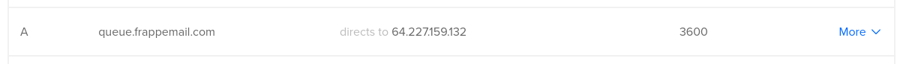
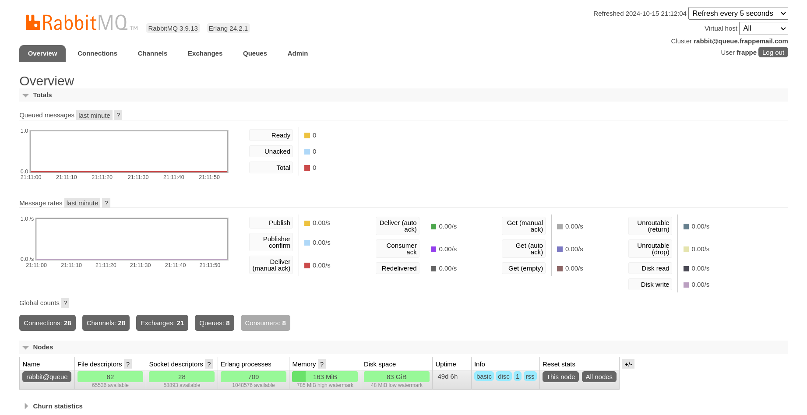

## Step 2: Set Up RabbitMQ

RabbitMQ is a key component that enables communication between the Mail app and the Inbound/Outbound Mail Agents. It acts as the message broker to manage the email queue. Before installing RabbitMQ, let's set up a DNS record for easier access.

### 2.1 Add a DNS A Record

To make your RabbitMQ server accessible under a subdomain, add a DNS A record pointing to your RabbitMQ VPS. For this example, we'll point `queue.frappemail.com` to the RabbitMQ server.

1. **Login to your DNS provider's dashboard** (such as Cloudflare, GoDaddy, or your registrar's DNS management panel).
2. **Add an A Record:**

   - **Name:** queue
   - **Type:** A
   - **TTL:** Auto or a specific TTL value
   - **Value:** IP address of your RabbitMQ VPS

   This points `queue.your-domain.com` to your RabbitMQ instance, allowing your Mail and Mail Agents to connect via this subdomain.

   

### 2.2 Install RabbitMQ

Now that the DNS is set up, we can move on to installing RabbitMQ.

1. **Update your system:** First, make sure your VPS is up to date by running the following commands:

   ```bash
   sudo apt update
   sudo apt upgrade -y
   ```

2. **Install RabbitMQ:**

   ```bash
   sudo apt install -y rabbitmq-server
   ```

3. **Enable and Start RabbitMQ:** Ensure RabbitMQ is enabled and starts automatically:

   ```bash
   sudo systemctl enable rabbitmq-server
   sudo systemctl start rabbitmq-server
   ```

4. **Verify RabbitMQ Status:** Check that RabbitMQ is running correctly:

   ```bash
   sudo systemctl status rabbitmq-server
   ```

### 2.3 Configure RabbitMQ

1. **Create a RabbitMQ Admin User:** By default, RabbitMQ creates a guest user, but it's recommended to set up a separate admin user:

   ```bash
   sudo rabbitmqctl add_user frappe STRONG_PASSWORD
   sudo rabbitmqctl set_user_tags frappe administrator
   sudo rabbitmqctl set_permissions -p / frappe ".*" ".*" ".*"
   ```

2. **Enable the RabbitMQ Management Plugin:** This will allow you to monitor and manage RabbitMQ through a web-based interface:

   ```bash
   sudo rabbitmq-plugins enable rabbitmq_management
   ```

   You can now access the RabbitMQ management interface at:

   `http://queue.your-domain.com:15672` using the frappe (admin) user credentials.

   

### 2.4 Secure RabbitMQ

1. **Firewall Settings:** If you are using a firewall, ensure RabbitMQ’s ports are open:

   ```bash
   sudo ufw allow 5672,15672/tcp
   ```

2. **Secure User Access:** Remove the default guest user to enhance security:

   ```bash
   sudo rabbitmqctl delete_user guest
   ```

3. **Enable TLS (Optional):** For added security, you can enable TLS to encrypt communication with RabbitMQ. Follow the guide [here](https://www.rabbitmq.com/docs/ssl) to set up TLS.

Now, RabbitMQ is set up and ready to serve as the backbone for communication between the Mail service and Mail Agents.
