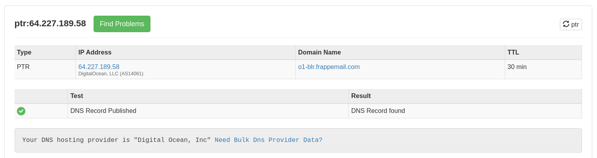
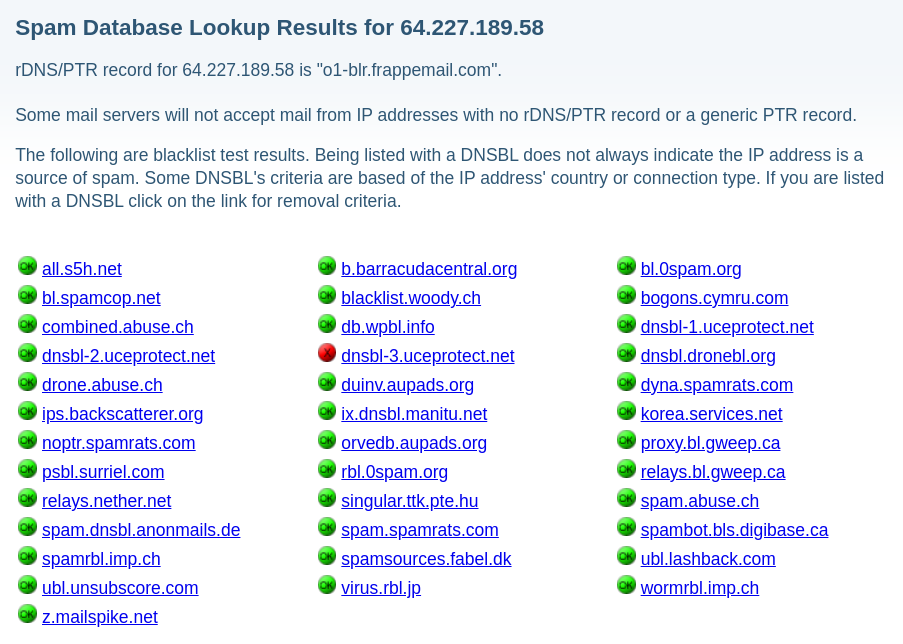
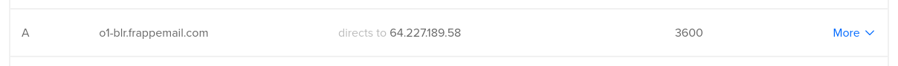
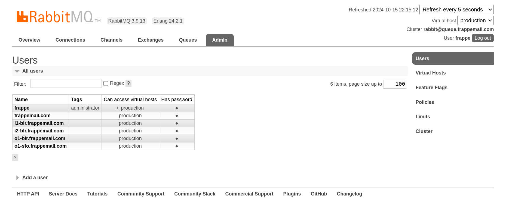

## Step 4: Set Up Outbound Mail Agents

Before configuring your Outbound Mail Agents, it is crucial to ensure the VPS IP address is not blacklisted and that a PTR (reverse DNS) record is set up. These steps are vital to maintaining email deliverability and preventing your emails from being flagged as spam, especially by major email providers like Gmail and Outlook.

### 4.1 Set Up PTR (Reverse DNS) Record

A PTR (reverse DNS) record is essential for outbound email servers. This record resolves an IP address to a domain name, and many email services (such as Gmail and Outlook) require it to verify the sender’s authenticity.

1. **Contact your VPS provider:** Most VPS providers offer reverse DNS management. Check your VPS provider’s dashboard or contact their support team to set up a PTR record.
2. **Set PTR Record to Your Outbound Mail Agent Domain:** Set the PTR record for your server’s IP address to point to your outbound Mail Agent domain (e.g., `o1-blr.frappemail.com`). Make sure the reverse DNS name matches the A record for the IP address.
3. **Verify PTR Setup:** Once the PTR record is set up, you can verify it using a tool like [MXToolbox](https://mxtoolbox.com/ReverseLookup.aspx). This will confirm that the reverse DNS is working correctly.

   

### 4.2 Check IP Blacklist Status

After confirming that your PTR record is correctly set, check if your VPS IP is blacklisted:

1. **Use a Blacklist Lookup Service:** Check if your IP is listed on any blacklists using tools like [MXToolbox](https://mxtoolbox.com/blacklists.aspx) or [DNSBL.info](https://www.dnsbl.info/).

   

2. **Evaluate the Results:**
   - If your IP is listed on **1-2 blacklists**, it may not be a significant issue.
   - If your IP is listed on **more than 2 blacklists**, consider creating a new VPS or switching providers to avoid deliverability issues.

### 4.3 Add a DNS A Record

Next, you need to create a DNS record for your outbound Mail Agent using the following naming convention:

```plaintext
<agent-type><agent-number>-<region-short-name>.<root-domain>
```

For example, for the first outbound Mail Agent in Bangalore:

```plaintext
o1-blr.frappemail.com
```

**Steps to Add the DNS Record:**

1. **Login to your DNS provider's dashboard** (such as Cloudflare, GoDaddy, etc.).
2. **Add an A Record:**

   - **Name:** `o1-blr` (or your chosen name based on the convention)
   - **Type:** A
   - **TTL:** Auto or a specific TTL value
   - **Value:** IP address of your outbound Mail Agent VPS

   This DNS record makes your outbound Mail Agent accessible under the defined hostname.

   

### 4.4 Create a RabbitMQ User for Mail Agent

Before installing the Mail Agent, create a RabbitMQ user for it. This user will be identified by its FQDN (e.g., `o1-blr.frappemail.com`). You can create this user via the RabbitMQ management interface or using the CLI.

- **To add the user via CLI:**

  ```bash
  sudo rabbitmqctl add_user o1-blr.frappemail.com STRONG_PASSWORD
  sudo rabbitmqctl set_permissions -p / o1-blr.frappemail.com ".*" ".*" ".*"
  ```

  

### 4.5 Install Mail Agent

With the DNS record created, proceed with installing your outbound Mail Agent.

1. **Update your system:**
   ```bash
   sudo apt update
   sudo apt upgrade -y
   ```
2. **Install the required packages:**

   ```bash
   sudo apt install python3-virtualenv -y
   ```

   Install Node.js and Yarn:

   ```bash
   curl -fsSL https://deb.nodesource.com/setup_20.x | sudo -E bash -
   sudo apt install -y nodejs
   sudo npm install -g yarn
   ```

3. **Generate a TLS certificate:** If you don’t have a TLS certificate, generate one using Let’s Encrypt:

   ```bash
   sudo apt install certbot -y
   sudo certbot certonly --standalone -d $(hostname -f)
   ```

4. **Install the Mail Agent CLI:** Clone the Mail Agent repo and set up the environment:

   ```bash
   git clone https://github.com/frappe/mail_agent
   cd mail_agent
   virtualenv venv
   source venv/bin/activate
   pip install .
   ```

5. **Set up the Mail Agent:** Use the setup command to configure the agent:

   ```bash
   mail-agent setup --prod
   ```

   Follow the prompt and provide details such as the hostname, Agent ID, Haraka, RabbitMQ host, etc. Upon successful setup, a success message will appear in the CLI.

6. **Verify the setup:** Check the status of Haraka and Mail Agent services:

   ```bash
   sudo systemctl status haraka
   sudo systemctl status mail-agent #outbound
   ```

### 4.6 Set Up Additional Outbound Mail Agents

To set up more outbound Mail Agents, repeat the above steps for each additional agent. For instance, for a second outbound Mail Agent in San Francisco, create a DNS record like:

```plaintext
o1-sfo.frappemail.com
```

Repeat the DNS and installation steps to set up the additional agents.
