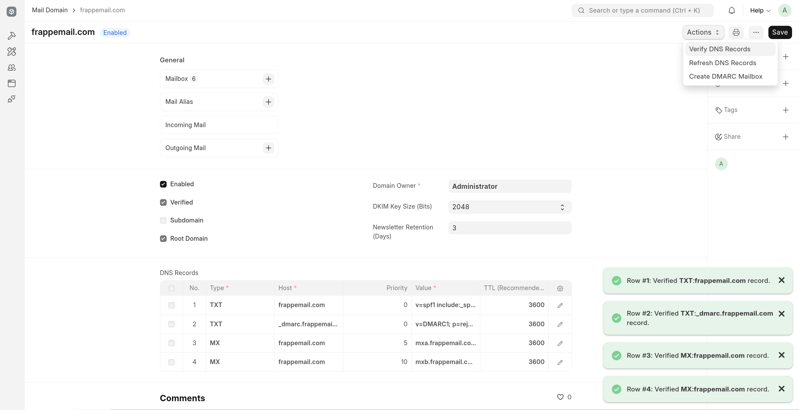
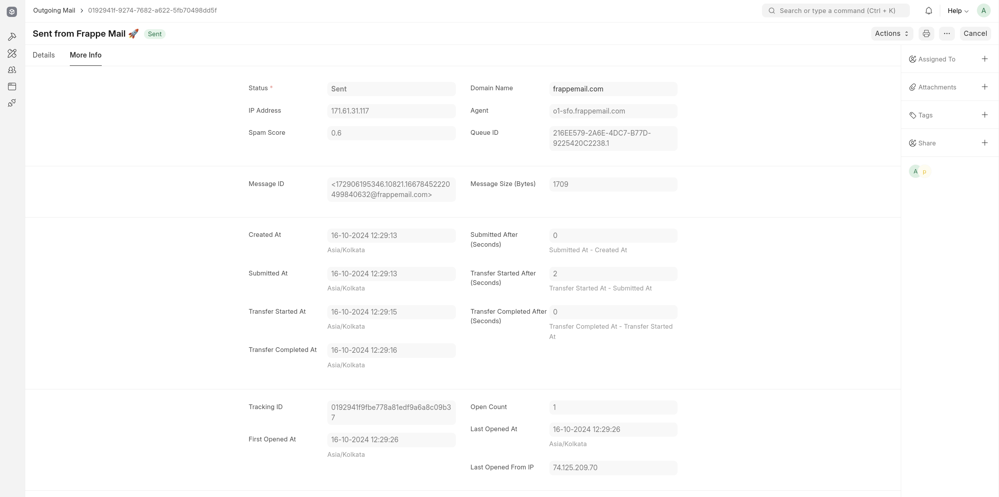

## Step 6: Configure Mail App

Great progress so far! Now it’s time to tie everything together and complete the setup. Log in to your Mail site (e.g., `frappemail.com/app`) as an Administrator.

### 6.1 Go to Mail Settings

- Navigate to **Mail Settings**.
- Add your **Root Domain** (for example, `frappemail.com`).

  

### 6.2 Configure DNS Provider (Optional)

If you are using **DigitalOcean** as your DNS provider:

1. Set the **DNS Provider** as DigitalOcean.
2. Obtain and set your **DNS Provider Token** (Ensure the token has **read**, **create**, **update**, and **delete** access).

   

This setting will automate the DNS record management, eliminating the need to manually add records through your DNS provider.

If you're using a different DNS service like **Amazon Route 53**, you can customize the app to integrate with your provider, or contribute code to support it.

### 6.3 Configure RabbitMQ

1. Go to the **RabbitMQ** tab.
2. Add the necessary details like: **Host**, **Port**, **Vhost**, **Username** and **Password**.
3. After saving, you can **test connection** to ensure everything is set up correctly.

   

### 6.4 Configure SpamAssassin (Optional)

1. Go to the **SpamAssassin** tab.
2. Add the **host** and **port** of your SpamAssassin server.
3. Adjust any additional settings based on your requirements.

   

### 6.5 Explore Other Settings

There are various other settings in Mail Settings. Feel free to explore and adjust these settings according to your needs to further optimize your mail service.

### 6.5 Add Mail Agents

In this step, you will add your Inbound and Outbound Mail Agents.

1. Go to the **Mail Agents.**

2. Add Your **Inbound** and **Outbound Agents:**

   - For now, you can add your Inbound Mail Agent directly, and it will function correctly.
   - However, be aware that if you plan to add more inbound agents in the future, you will need to update all domains associated with your email service.

3. **Use Groups for Better Management:**

   - A more efficient way to manage multiple inbound agents is to create two groups for your agents. For instance, you can set up:
     - `mxa.frappemail.com`
     - `mxb.frappemail.com`

   Initially, you can point these to your existing inbound agents directly.

4. **Future Scalability:**

   - When you expand and have more than two inbound agents, you can configure these groups to point to a **load balancer**. This load balancer will intelligently redirect SMTP requests to the available inbound agent within the group, ensuring seamless handling of incoming emails.
   - Setting up two load balancers with multiple inbound agents will significantly reduce downtime, providing a more robust and reliable email service.

   

### 6.6 Validate and Configure DNS Record

After you create your **Outbound Mail Agents**, a DNS record will be generated. Follow these steps:

1. **Add the DNS Record:**

   - If you have not configured your DNS provider settings in the Mail Settings, you will need to manually add the generated DNS record to your DNS provider.
   - This DNS record is an SPF record that includes all your outbound servers, ensuring proper email delivery and authentication.

     

2. **Verify the DNS Record:**
   - You can validate the DNS record directly from the DNS Record document by using the **Action > Verify DNS Record** button.
   - This will check if the SPF record is correctly set up and recognized by DNS servers.

### 6.7 Add Your Domains

Now that your outbound mail agents and DNS records are configured, it’s time to add the domains you want to use for sending and receiving emails. This process ensures proper email functionality and authentication (such as DKIM, SPF, and DMARC).

1. **Go to the Mail Domain:** Add the domains you wish to utilize. You can start with your root domain (e.g., `frappemail.com`) and also include any subdomains (e.g., `mail.frappemail.com`).

   

2. **Generated DNS Records:** Upon saving the Mail Domain document, several DNS records will be generated. You must add these records to your domain registrar for proper email functionality.

   

3. **Verify DNS Records:**

   - After adding the records to your DNS provider, return to your **Mail Domain** document.
   - Use the **Action > Verify DNS Records** button to validate that the records have been correctly set up and propagated. If any DNS records are incorrect or missing, the system will notify you.

     

4. **DKIM Keys:**

   - Along with the domain setup, **DKIM keys** (DomainKeys Identified Mail) will be generated. These keys help verify that the emails sent from your domain have not been tampered with.
   - If your DNS provider is not configured in the Mail Settings, you will need to manually add these DKIM keys to your root domain's DNS.
   - You can find the DKIM key in the **DKIM Key List**, along with a linked DNS record that you can refer to when adding it to your DNS provider.

     
     

   **Important:** If DKIM keys are not properly added, your emails may be flagged as spam or rejected by recipient servers.

5. **Auto-Created Mailbox:** Upon setting up a new domain, certain system mailboxes (like `dmarc@frappemail.com`) will be automatically created. These mailboxes are typically used for receiving DMARC reports or other system notifications.

6. **Add Mailboxes:** Once your domain is configured, you can start adding additional mailboxes for your domain (e.g., `sagar.s@frappemail.com`).

   

7. **Repeat for Additional Domains:** If you manage multiple domains, repeat the process to add more domains. This ensures that each domain has its own proper configuration for email delivery and security.

By following these steps, your domain will be properly set up for secure email communication. Be sure to verify the DNS records and ensure all mailboxes are properly configured for each domain you use.

### 6.8 Now You Are Ready to Send Emails

Once everything is set up, you're ready to start sending emails!

1. Go to the **Outgoing Mail**.

2. **Create a New Email:** Compose your email and submit it. Once submitted, the email will be transferred to RabbitMQ, where it will be picked up and delivered by one of your outbound Mail Agents.

3. **Delivery Status:**

   - The delivery status of the email may take a little time to sync, as this is managed by a scheduled job.
   - You can track all the details of the email, including any delays and the response from the recipient's server.

   
   
   

### 6.9 Track Incoming Emails

Similarly, you can track all your incoming emails.

1. Go to the **Incoming Mail**.

2. **Check for Incoming Mails:**

   - Any emails sent to your configured domains will appear in the **Incoming Mail** list.
   - You can review all the relevant details for each email, such as the sender, recipient, and timestamps.

     
     

This allows you to easily manage and track all incoming emails alongside the outgoing ones.
